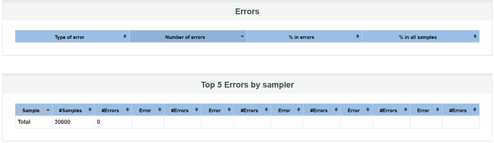

# Performance Testing (Restful Booker)

Hello and welcome! This GitHub repository contains the performance testing documentation for restful-booker.herokuapp.com, for a collection of API with various HTTP methods. Here, performance testing is done using Jmeter to determine the maximum load capacity of this collection of API to be called without any errors when a huge number of concurrent threads(users) are made. 

All the test files (jmx, jtl & html files) are included in this repository and the following is a report of all the test procedures and reports.
## Summary

- While executing 5100 concurrent threads(users), a total of 30600 requests are made with error rate 0.00%.


- While executing 5150 concurrent threads(users), a total of 30900 requests are made with error rate 0.01%.


- While executing 5200 concurrent threads(users), a total of 31200 requests are made with error rate 26.32%.


## Collection of API

A set of API for restful-booker.herokuapp.com covering various HTTP methods i.e. POST, GET, DELETE, and PUT are used for test data. Data is set, called, then updated using token and then deleted using token all within this set of API for this test coverage.


## Load Testing

For finding the maximum load capacity of restful-booker.herokuapp.com when reqesting a collection of API, Jmeter is used where Thread Groups of huge number of threads(users) are made. For this test, Thread Groups of 5100, 5150 and 5200 threads are found to be suitable data. For all Thread Groups, Ramp-up period is set to 10s with loop count of 1.


Using the command-line interface, the following command-line is used for making JTL files where we can see the load testing results in command-line interface.

```bash
  jmeter -n -t TestPlan_t5100.jmx -l report\TestPlan_t5100.jtl
```


Afterwards using the above JTL files, using the command-line interface the following command-line is used for making HTML reports.

```bash
  jmeter -n -t jmeter -g report\TestPlan_t5100.jtl -o report\TestPlan_t5100.html
```


## First Thread Group

Number of Threads: 5100, Ramp-up Period: 10s


After running the load testing in command-line interface we can see the APIs are requested without any errors. Below is the HTML report view and errors.

Requests Summary             |  Errors
:-------------------------:|:-------------------------:
  |  

We can see here that, this collection of API run without any errors for 5100 threads and passes the load test.
## Second Thread Group

Number of Threads: 5150, Ramp-up Period: 10s


After running the load testing in command-line interface we can see the APIs are requested with very minor errors. Below is the HTML report view and errors.

Requests Summary             |  Errors
:-------------------------:|:-------------------------:
  |  

We can see here that, this collection of API run with very minor errors (less than 1%) for 5150 threads and still can be accepted to have passed the load test.


## Third Thread Group

Number of Threads: 5200, Ramp-up Period: 10s


After running the load testing in command-line interface we can see the APIs are requested with a lot of errors. Below is the HTML report view and errors.

Requests Summary             |  Errors
:-------------------------:|:-------------------------:
  |  

We can see here that, this collection of API run with a lot of errors (more than 25%) for 5200 threads and therefore can be determined to have failed the load test.
## Conclusion

Therefore from this in-depth performance testing of restful-booker.herokuapp.com for a collection of API using three Thread Groups, it is determined that the maximum load capacity of running the aforementioned collection of APIs without any errors is 5100 concurrent threads and with very minor errors (less than 1%) is 5150 concurrent threads. Using threads any more than this causes significant amount of errors.


